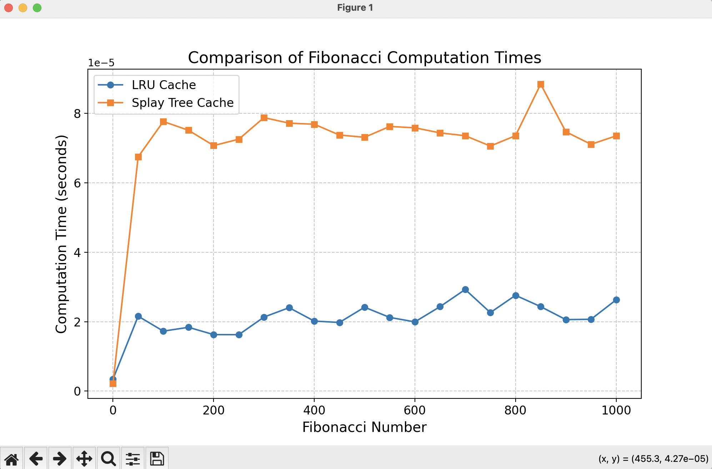

# goit-algo2-hw-07

Design and Analysis of Algorithms: Conducted a comparative analysis of cache management algorithms. Evaluated task execution performance across three scenarios: without caching, using an LRU (Least Recently Used) cache, and leveraging a Splay Tree for dynamic cache management.

# Task 1

Generate 50000 request for getting sum in random range of numbers from 0 to 100000 using LRU-cache and without it.
We have obtained such a results for the given task:

Unfortunately for this specific task we could not get the difference and LRU-cache usage and normal no cache execution. We see that for this range of numbers we didn't have hits in cached values.

If we decrease number array length and use only range request we see that there is no time improvement, but we have some hits in cache.

This task can't be a good example of LRU-cache usage.

# Task 2

Calculate fibonacci number using LRU-cache and Splay tree cache algorithms.

The results demonstrate that the LRU cache is significantly more efficient than the Splay Tree cache for this task, reducing the time required to compute Fibonacci numbers by several times.
